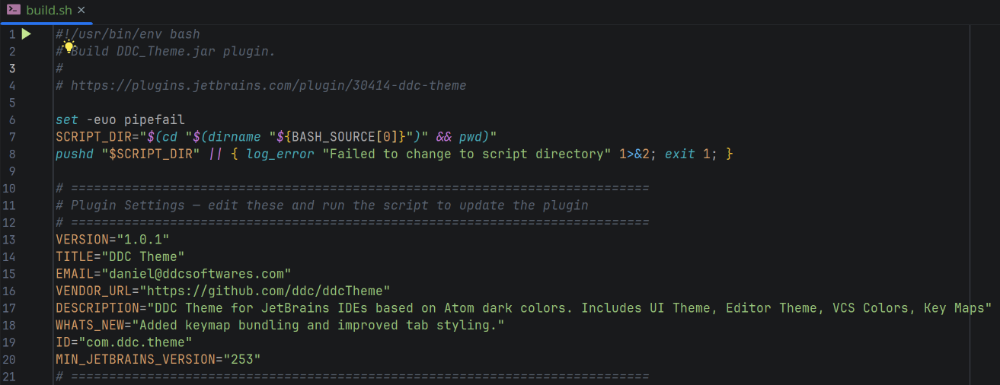
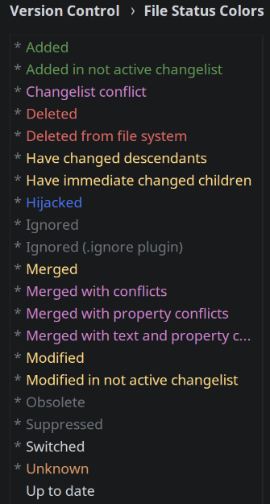

<h1 align="center">
  
  <br>
  DDC Jetbrains Theme
</h1>

<p align="center">
    <a href="https://github.com/sponsors/ddc"></a>
    <br>
    <a href="https://ko-fi.com/ddcsta"></a>
    <a href="https://www.paypal.com/ncp/payment/6G9Z78QHUD4RJ"></a>
    <br>
    <a href="https://plugins.jetbrains.com/plugin/30414-ddc-theme"></a>
    <a href="https://www.apache.org/licenses/LICENSE-2.0"></a>
    <a href="https://github.com/ddc/JetbrainsTheme/releases/latest"></a>
    <br>
    <a href="https://github.com/ddc/JetbrainsTheme/issues"></a>
    <a href="https://github.com/ddc/JetbrainsTheme/actions/workflows/workflow.yml"></a>
    <a href="https://actions-badge.atrox.dev/ddc/JetbrainsTheme/goto?ref=master"></a>
</p>

<p align="center">A dark theme for JetBrains IDEs based on <a href="https://github.com/atom/atom/tree/master/packages/one-dark-ui">Atom One Dark</a> colors.<br>Includes UI Theme, Editor Theme, VCS Colors, Key Maps, Code Style, Window Layout, and Selection Occurrence Highlighting.</p>

<p align="center">📦 <b><a href="https://plugins.jetbrains.com/plugin/30414-ddc-theme">Install from JetBrains Marketplace</a></b> 📦 </p>

# Table of Contents

- [Screenshot](#screenshot)
- [Features](#features)
- [Installation](#installation)
    - [From Marketplace](#from-marketplace)
    - [From Plugin ZIP](#from-plugin-zip)
- [Getting Started](#getting-started)
- [Building](#building)
- [Version Control File Status Colors](#version-control-file-status-colors)
- [License](#license)
- [Support](#support)

# Screenshot
<p align="left">
  
</p>

# Features

| Component                   | Description                                                                                                    |
|-----------------------------|----------------------------------------------------------------------------------------------------------------|
| UI Theme                    | Dark UI with custom backgrounds, borders, and popups                                                           |
| Editor Scheme               | Syntax highlighting and editor colors                                                                          |
| VCS Colors                  | Custom file status colors for version control                                                                  |
| Key Maps                    | Custom keyboard shortcuts                                                                                      |
| Code Style                  | Formatting and indentation settings for multiple languages                                                     |
| Window Layout               | Tool window arrangement and positions                                                                          |
| Selection Highlighting      | Highlights all occurrences of selected text (disabled by default — enable in **Settings > Tools > DDC Theme**) |
| Install/Update Notification | Shows what's new on first install or after an update                                                           |

# Installation
## From Marketplace

1. In your JetBrains IDE, go to **Settings > Plugins > Marketplace**
2. Search for **DDC Theme**
3. Click **Install** and restart the IDE

## From Plugin ZIP

1. Download the latest `DDC-Theme-*.zip` from [Releases](https://github.com/ddc/JetbrainsTheme/releases)
2. Go to **Settings > Plugins > Install Plugin from Disk...**
3. Select the downloaded `.zip` file and restart the IDE

# Getting Started

After install and restart, the **UI Theme**, **Editor Theme**, and **Key Maps** are applied automatically.
The following extras are installed but not activated — enable them if you'd like:

| Extra                      | How to activate                                                |
|----------------------------|----------------------------------------------------------------|
| **Window Layout**          | **Window > Layouts > DDC Window Layout > Restore**             |
| **Code Style**             | **Settings > Editor > Code Style** > select **DDC Code Style** |
| **Selection Highlighting** | **Settings > Tools > DDC Theme** > enable the checkbox         |

> **Note:** All settings are removed automatically when the plugin is uninstalled.

# Building

Requires JDK 21.

```bash
./build.sh
```

The script builds `DDC-Theme-<version>.zip` inside the `build/` directory.
Plugin settings (`VERSION`, `PLATFORM_VERSION`, `WHATS_NEW`) are configured at the top of `build.sh`.

# Version Control File Status Colors
<table>
<tr>
<td>

| Status                                  | Color                                                | Hex      |
|-----------------------------------------|------------------------------------------------------|----------|
| Added                                   |  | `629755` |
| Added (inactive changelist)             |  | `629755` |
| Changelist conflict                     |  | `CF84CF` |
| Deleted                                 |  | `DE6A66` |
| Deleted from file system                |  | `DE6A66` |
| Have changed descendants                |  | `FEDB89` |
| Have immediate changed children         |  | `FEDB89` |
| Hijacked                                |  | `4C72E8` |
| Ignored                                 |  | `6F737A` |
| Ignored (.ignore plugin)                |  | `6F737A` |
| Merged                                  |  | `FEDB89` |
| Merged with conflicts                   |  | `CF84CF` |
| Merged with property conflicts          |  | `CF84CF` |
| Merged with text and property conflicts |  | `CF84CF` |
| Modified                                |  | `FEDB89` |
| Modified (inactive changelist)          |  | `FEDB89` |
| Obsolete                                |  | `6F737A` |
| Suppressed                              |  | `6F737A` |
| Switched                                |  | `D1D3D9` |
| Unknown                                 |  | `9A8447` |
| Up to date                              |  | `D1D3D9` |

</td>
<td>
  
</td>
</tr>
</table>

# License
Released under the [Apache 2.0](LICENSE)

# Support
If you find this project helpful, consider supporting development:

- [GitHub Sponsor](https://github.com/sponsors/ddc)
- [ko-fi](https://ko-fi.com/ddcsta)
- [PayPal](https://www.paypal.com/ncp/payment/6G9Z78QHUD4RJ)
